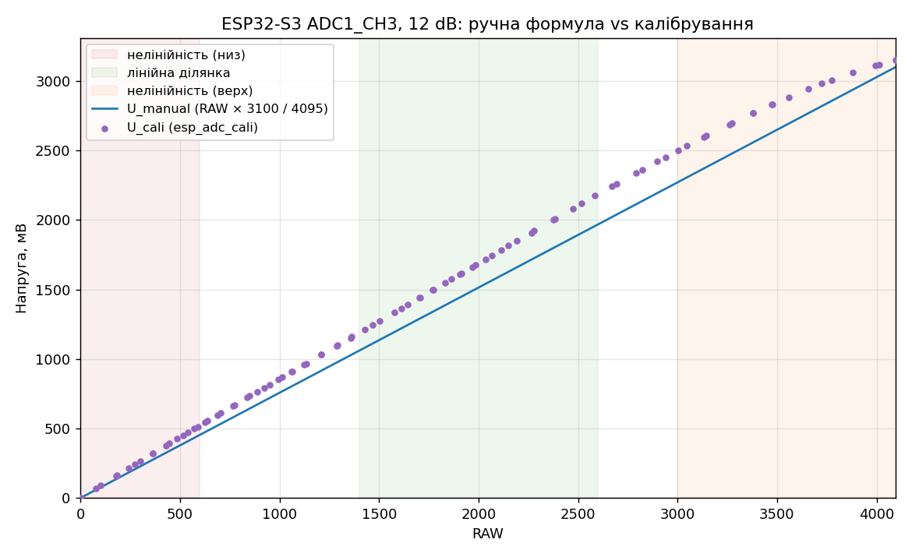
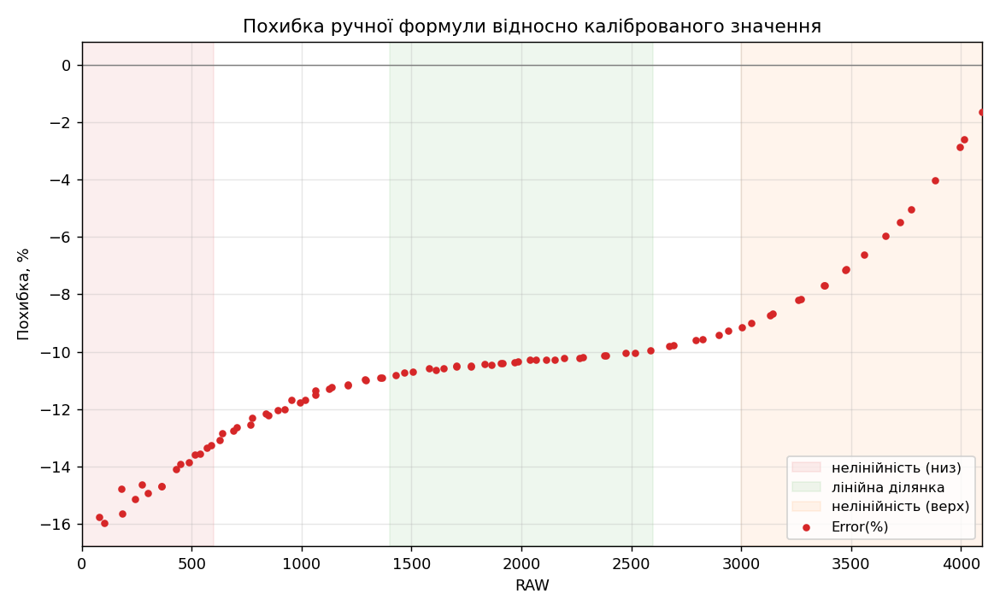

# Модуль 3.2 — Калібрування даних з ADC

Домашнє завдання: зчитування напруги з потенціометра через АЦП ESP32-S3, порівняння ручного розрахунку напруги з каліброваним значенням (`esp_adc_cali`) та аналіз похибки.

## Обладнання

| Компонент | Значення |
|---|---|
| Плата | YD-ESP32-S3 N16R8 |
| Потенціометр | 10 кОм, увімкнений як подільник напруги |
| Конденсатор (опційно) | 100 нФ (маркування `104`), фільтр шуму |
| Фреймворк | ESP-IDF v5.x |

## Схема підключення

```
                YD-ESP32-S3
             ┌───────────────┐
   ┌─────────┤ 3V3           │
   │   ┌─────┤ GPIO4 (ADC1_CH3)
   │   │  ┌──┤ GND           │
   │   │  │  └───────────────┘
   │   │  │      Потенціометр 10 кОм
   │   │  │     ┌──────────────┐
   └───┼──┼─────┤ 1 (край)     │
       └──┼─────┤ 2 (повзунок) │──┐
          ├─────┤ 3 (край)     │  │
          │     └──────────────┘  │
          └────────┤├─────────────┘
                 100 нФ (опційно)
```

| Потенціометр | ESP32-S3 |
|---|---|
| Крайній вивід 1 | 3V3 |
| Повзунок | GPIO4 (ADC1_CH3) |
| Крайній вивід 3 | GND |

Використано ADC1, бо ADC2 конфліктує з Wi-Fi.

## Параметри АЦП

| Параметр | Значення |
|---|---|
| Блок / канал | ADC1 / CH3 (GPIO4) |
| Розрядність | 12 біт (0…4095) |
| Атенюація | 12 dB (`ADC_ATTEN_DB_12`), діапазон ~0…3100 мВ |
| Опорна напруга | ~1100 мВ, внутрішня, індивідуальна для чипа (eFuse) |
| Схема калібрування | Curve fitting (`adc_cali_create_scheme_curve_fitting`) |
| Період вимірювань | 100 мс |
| Усереднення | 8 зчитувань на одне вимірювання |

## Методика

Для кожного вимірювання з одного й того ж RAW значення обчислюються:

- **U_manual** — за лінійною формулою: `U = RAW × 3100 / 4095` (мВ)
- **U_cali** — через `adc_cali_raw_to_voltage()`
- **Error(%)** — `(U_manual − U_cali) / U_cali × 100`

Рядок у таблицю виводиться, коли RAW змінився щонайменше на 50, тому для отримання таблиці потенціометр повільно обертається від упору до упору й назад.

## Результати

Фрагмент виводу в консоль (повний CSV: [`data/adc_output.csv`](data/adc_output.csv)):

```
 RAW   U_manual(mV)   U_cali(mV)   Error(%)
--------------------------------------------
 101           76.5           91     -15.98
 539          408.0          472     -13.55
1014          767.6          869     -11.67
2067         1564.8         1744     -10.28
3047         2306.6         2535      -9.01
3993         3022.8         3112      -2.87
4095         3100.0         3152      -1.65
```

### Напруга від RAW



### Похибка від RAW



## Аналіз нелінійності

На графіку похибки видно три ділянки:

| Ділянка | RAW | Напруга | Поведінка |
|---|---|---|---|
| Низ шкали | < ~600 | < ~500 мВ | Похибка до −16%: зміщення нуля АЦП, відносна похибка роздувається на малих значеннях |
| Середина | ~1400…2600 | ~1.2…2.1 В | Похибка майже стала (~−10.3%) — найбільш лінійна ділянка |
| Верх шкали | > ~3000 | > ~2.5 В | Похибка швидко прямує до 0: крива АЦП «загинається» біля межі діапазону |

Постійна похибка ~−10% у лінійній ділянці означає, що номінальна повна шкала 3100 мВ не відповідає реальній: нахил каліброваної кривої там ≈0.84 мВ/LSB, що відповідає ефективній шкалі ~3.4 В.

Прохід потенціометра вгору та вниз дає ті самі значення (напр. RAW 364 → 323 мВ в обох напрямках), тобто гістерезису немає, вимірювання повторювані.

## Висновки

- Лінійна формула з одним параметром (повна шкала) не описує реальну передавальну характеристику АЦП ESP32-S3: похибка змінюється від −16% до −1.7% залежно від ділянки шкали.
- Калібрування з коефіцієнтами з eFuse (curve fitting) враховує індивідуальні особливості чипа та нелінійність, тому для вимірювань слід використовувати саме його.
- Для найточніших вимірювань варто працювати в діапазоні ~0.2…2.5 В і уникати країв шкали.

## Збірка та запуск

```bash
idf.py set-target esp32s3
idf.py build flash monitor
```

Консоль — через USB-порт **COM** на платі.

Налаштування у верхній частині `main/main.c`:

| Макрос | Призначення |
|---|---|
| `U_FULL_SCALE_MV` | повна шкала для ручної формули (3100 мВ) |
| `PRINT_MIN_DELTA` | мінімальна зміна RAW для виводу рядка (0 — кожне вимірювання) |
| `OUTPUT_CSV` | 1 — вивід у CSV для графіків |

## Побудова графіків

```bash
pip install matplotlib
python tools/plot.py data/adc_output.csv
```

Графіки зберігаються в `images/`.

## Структура проєкту

```
├── CMakeLists.txt
├── sdkconfig.defaults
├── main/
│   ├── CMakeLists.txt
│   └── main.c
├── data/
│   └── adc_output.csv
├── images/
│   ├── voltage_vs_raw.png
│   └── error_vs_raw.png
└── tools/
    └── plot.py
```
## Демо

[](https://www.youtube.com/shorts/zWtjxZrQspw)