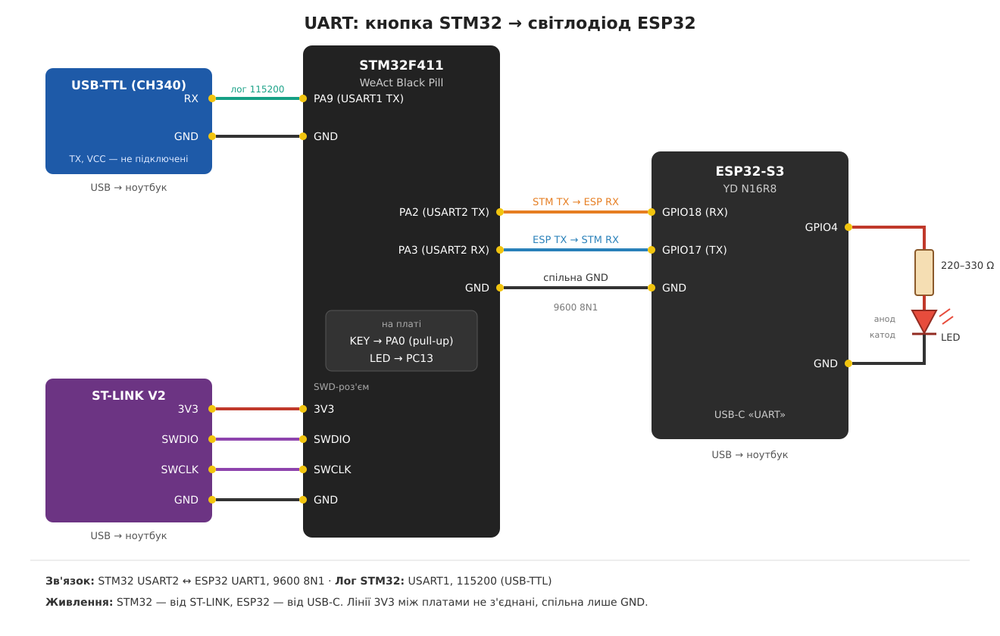

# UART: STM32 керує світлодіодом на ESP32

Натискання кнопки на STM32 (Black Pill) перемикає стан світлодіода на ESP32-S3. Плати обмінюються текстовими командами через UART і підтверджують кожну команду відповіддю ACK.

## Обладнання

| Компонент | Призначення |
|---|---|
| WeAct Black Pill STM32F411CEU6 | кнопка KEY (PA0), надсилає команди |
| YD-ESP32-S3 N16R8 | приймає команди, керує світлодіодом |
| Світлодіод + резистор 220–330 Ω | індикатор на ESP32 (GPIO4) |
| ST-LINK V2 | прошивка й живлення STM32 |
| USB-TTL (CH340) | перегляд логів STM32 |

## Схема з'єднань



## Параметри UART

| Лінія | Інтерфейс | Налаштування |
|---|---|---|
| Зв'язок STM32 ↔ ESP32 | STM32 USART2 / ESP32 UART1 | 9600 8N1, без flow control |
| Лог STM32 | STM32 USART1 (PA9) | 115200 8N1 |
| Лог ESP32 | ESP32 UART0 (консоль, USB) | 115200 |

## Протокол

Текстові команди, кожен рядок закінчується `\n`.

| STM32 → ESP32 | ESP32 → STM32 | Дія |
|---|---|---|
| `ON` | `ACK ON` | увімкнути LED |
| `OFF` | `ACK OFF` | вимкнути LED |
| інше | `ERR` | ігнорується |

**Надійність на стороні STM32:**
- чекає на ACK до **200 мс**, робить до **3 спроб**;
- якщо ESP32 так і не підтвердив команду, стан відкочується, щоб не розійтися з реальним станом LED;
- помилки прийому UART (framing, overrun) рахуються й виводяться в лог;
- прийом працює через переривання (`HAL_UART_Receive_IT`) у кільцевий буфер на 64 байти.

**Кнопка:** PA0 з внутрішнім pull-up, активний рівень низький, debounce 20 мс, одне перемикання на одне натискання.

Світлодіод **PC13** на Black Pill дублює підтверджений стан LED на ESP32.

## Структура репозиторію

```
.
├── README.md
├── esp32/        # проєкт ESP-IDF
├── stm32/        # проєкт STM32CubeIDE
└── docs/
    └── wiring.png
```

## Збірка та прошивка

### ESP32-S3

Потрібен ESP-IDF v6.0.

```bash
cd esp32
idf.py set-target esp32s3
idf.py build
idf.py -p COMx flash monitor
```

Компонент `main` залежить від `esp_driver_uart` і `esp_driver_gpio` (див. `main/CMakeLists.txt`).

### STM32F411

1. Відкрити папку `stm32/` у STM32CubeIDE: **File → Import → Existing Projects into Workspace**.
2. Зібрати проєкт: **Project → Build Project**.
3. Прошити через ST-LINK: **Run**.

Налаштування периферії описані в `uart.ioc`: USART1 115200, USART2 9600 з увімкненим перериванням, PA0 як вхід з pull-up, PC13 як вихід, HSE 25 MHz → SYSCLK 100 MHz.

## Перевірка

1. Відкрити термінал на COM-порту USB-TTL (115200) і монітор ESP32.
2. Натиснути reset на обох платах.
3. Натиснути **KEY** на Black Pill: світлодіод на ESP32 і PC13 мають увімкнутися. Повторне натискання вимикає їх.

**Лог STM32:**
```
[STM] boot. button PA0 -> ESP32 LED
[STM] TX -> ON (attempt 1)
[STM] RX <- ACK ON
[STM] TX -> OFF (attempt 1)
[STM] RX <- ACK OFF
```

**Лог ESP32:**
```
I (...) LINK: Start. UART1 9600 8N1, TX=17 RX=18, LED GPIO4
I (...) LINK: RX 'ON'  -> LED ON
I (...) LINK: RX 'OFF' -> LED OFF
```

**Якщо ESP32 не відповідає:**
```
[STM] TX -> ON (attempt 1)
[STM] NO ACK (got: '')
...
[STM] ESP32 not responding after 3 attempts
```

## Демо

[](https://youtube.com/shorts/4_achG34I20)